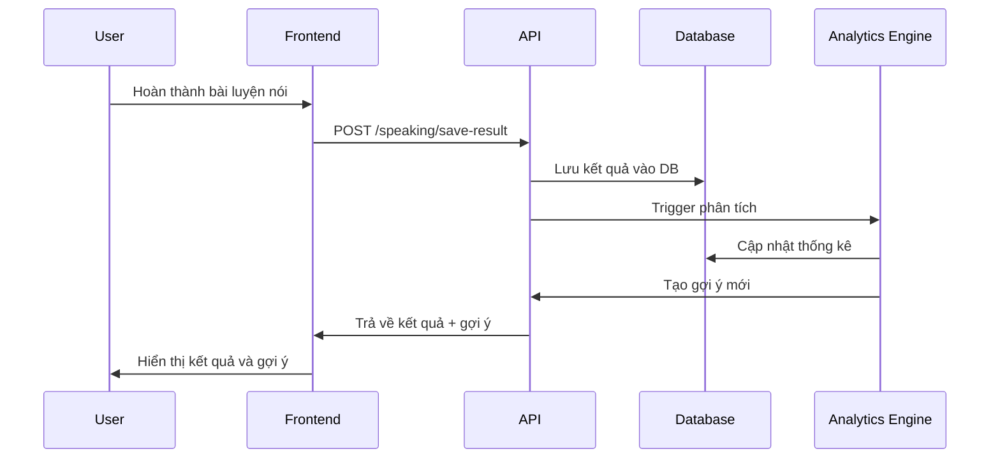

# Design Document: Speaking Progress Tracking

## Overview

Hệ thống theo dõi tiến độ luyện nói được thiết kế để ghi nhận, phân tích và cung cấp phản hồi về quá trình học tập của người dùng. Hệ thống sử dụng kiến trúc microservice với các component độc lập để xử lý dữ liệu, phân tích và đưa ra gợi ý.

## Architecture

### High-Level Architecture

```
┌─────────────────┐    ┌──────────────────┐    ┌─────────────────┐
│   Frontend      │    │   Backend API    │    │   Database      │
│   (React)       │◄──►│   (Express)      │◄──►│   (MongoDB)     │
└─────────────────┘    └──────────────────┘    └─────────────────┘
                              │
                              ▼
                       ┌──────────────────┐
                       │ Analytics Engine │
                       │ (Node.js)        │
                       └──────────────────┘
```

### Component Interaction Flow



## Components and Interfaces

### 1. Progress Tracker Component

**Chức năng:** Theo dõi và hiển thị tiến độ học tập

**Interface:**
```typescript
interface ProgressTracker {
  getUserProgress(userId: string): Promise<UserProgress>
  updateProgress(userId: string, result: PracticeResult): Promise<void>
  getProgressChart(userId: string, timeRange: string): Promise<ChartData>
  getStreakInfo(userId: string): Promise<StreakInfo>
}

interface UserProgress {
  totalSessions: number
  completedTopics: string[]
  averageAccuracy: number
  currentStreak: number
  weeklyStats: WeeklyStats[]
}
```

### 2. Result Storage Component

**Chức năng:** Lưu trữ và quản lý kết quả luyện tập

**Interface:**
```typescript
interface ResultStorage {
  saveResult(result: PracticeResult): Promise<string>
  getResults(userId: string, filters: ResultFilters): Promise<PracticeResult[]>
  getResultSummary(userId: string): Promise<ResultSummary>
}

interface PracticeResult {
  id: string
  userId: string
  sessionId: string
  itemId: string
  text: string
  spokenText: string
  accuracy: number
  pronunciationScore: number
  timestamp: Date
  level: string
  topic: string
}
```

### 3. Recommendation Engine Component

**Chức năng:** Phân tích dữ liệu và đưa ra gợi ý cá nhân hóa

**Interface:**
```typescript
interface RecommendationEngine {
  generateRecommendations(userId: string): Promise<Recommendation[]>
  analyzeWeaknesses(userId: string): Promise<WeaknessAnalysis>
  suggestNextLevel(userId: string): Promise<LevelSuggestion>
}

interface Recommendation {
  type: 'practice' | 'review' | 'level_up' | 'reminder'
  title: string
  description: string
  actionUrl: string
  priority: number
}
```

### 4. Analytics Dashboard Component

**Chức năng:** Hiển thị báo cáo và phân tích chi tiết

**Interface:**
```typescript
interface AnalyticsDashboard {
  getWeeklyReport(userId: string): Promise<WeeklyReport>
  getDetailedAnalysis(userId: string): Promise<DetailedAnalysis>
  getComparison(userId: string, period: string): Promise<ComparisonData>
}
```

## Data Models

### 1. Speaking Session Model

```typescript
interface SpeakingSession {
  _id: ObjectId
  userId: ObjectId
  level: string
  topic: string
  startTime: Date
  endTime?: Date
  status: 'active' | 'completed' | 'abandoned'
  totalItems: number
  completedItems: number
  averageAccuracy: number
  pronunciationScore: number
  results: ObjectId[] // References to PracticeResult
}
```

### 2. Practice Result Model

```typescript
interface PracticeResult {
  _id: ObjectId
  userId: ObjectId
  sessionId: ObjectId
  itemId: string
  text: string
  spokenText: string
  accuracy: number
  pronunciationScore: number
  timestamp: Date
  level: string
  topic: string
  mistakes: string[] // Các từ phát âm sai
  duration: number // Thời gian luyện tập (ms)
}
```

### 3. User Progress Model

```typescript
interface UserProgress {
  _id: ObjectId
  userId: ObjectId
  totalSessions: number
  totalPracticeTime: number // Tổng thời gian luyện (minutes)
  completedTopics: {
    level: string
    topic: string
    completedAt: Date
    averageScore: number
  }[]
  currentStreak: number
  longestStreak: number
  lastPracticeDate: Date
  weeklyGoal: number
  monthlyGoal: number
  achievements: string[] // Danh sách huy hiệu đã đạt
  level: string // Cấp độ hiện tại của user
}
```

### 4. Recommendation Model

```typescript
interface UserRecommendation {
  _id: ObjectId
  userId: ObjectId
  type: 'practice' | 'review' | 'level_up' | 'reminder'
  title: string
  description: string
  actionUrl: string
  priority: number
  isRead: boolean
  createdAt: Date
  expiresAt?: Date
}
```

## Correctness Properties

*A property is a characteristic or behavior that should hold true across all valid executions of a system-essentially, a formal statement about what the system should do. Properties serve as the bridge between human-readable specifications and machine-verifiable correctness guarantees.*

### Acceptance Criteria Analysis

Dựa trên phân tích prework, hầu hết các acceptance criteria đều có thể kiểm tra được thông qua property-based testing. Chỉ có một criteria (3.6 về cá nhân hóa tổng quát) không thể kiểm tra cụ thể do tính mơ hồ.

### Property-Based Testing Properties

**Property 1: Result Storage Integrity**
*For any* practice result with valid user input, saving the result should preserve all required fields (accuracy, pronunciation score, spoken text, user ID, timestamp) and the result should be retrievable with identical data
**Validates: Requirements 1.1, 1.4**

**Property 2: Practice Count Accuracy**  
*For any* sequence of practice attempts by a user, the system should accurately count and store the number of practice attempts per item and per session
**Validates: Requirements 1.2, 2.2**

**Property 3: Completion Status Logic**
*For any* topic with a defined number of items, when all items are completed by a user, the completion status should be marked as completed and remain persistent
**Validates: Requirements 1.3**

**Property 4: Data Persistence**
*For any* practice session, all practice results should be stored in the system and remain accessible through the user's practice history
**Validates: Requirements 1.5**

**Property 5: Statistics Calculation**
*For any* set of practice results, the calculated statistics (total sessions, completed topics, average scores) should accurately reflect the underlying data
**Validates: Requirements 2.1, 2.4**

**Property 6: Chart Data Generation**
*For any* user with practice history, the system should generate valid chart data with proper time series formatting and accurate progress values
**Validates: Requirements 2.3**

**Property 7: Streak Calculation**
*For any* sequence of practice dates, the streak counter should correctly identify consecutive practice days and reset when there are gaps
**Validates: Requirements 2.5, 5.3**

**Property 8: Trend Analysis**
*For any* time series of practice scores with sufficient data points, the system should correctly identify improvement trends (increasing, decreasing, or stable)
**Validates: Requirements 2.6**

**Property 9: Error-Based Recommendations**
*For any* user with consistent pronunciation errors in specific words/patterns, the recommendation engine should suggest relevant practice exercises targeting those errors
**Validates: Requirements 3.1, 3.4**

**Property 10: Level Progression Logic**
*For any* user with high performance scores at their current level, the system should suggest appropriate next-level content
**Validates: Requirements 3.2, 3.3**

**Property 11: Reminder System**
*For any* user with practice gaps exceeding the defined threshold, the system should generate appropriate reminder notifications
**Validates: Requirements 3.5**

**Property 12: Report Generation**
*For any* user with practice data, weekly reports should be generated with accurate statistics and proper formatting
**Validates: Requirements 4.1, 4.3**

**Property 13: Error Analysis**
*For any* collection of practice results containing pronunciation errors, the system should accurately identify and categorize frequently missed words/phrases
**Validates: Requirements 4.2**

**Property 14: Performance Insights**
*For any* user with varied practice times and performance data, the system should identify optimal practice time patterns
**Validates: Requirements 4.4**

**Property 15: Skill-Based Statistics**
*For any* practice results, statistics should be correctly categorized by skill type (pronunciation, accuracy, speed) with accurate calculations
**Validates: Requirements 4.5**

**Property 16: Achievement System**
*For any* user reaching predefined milestones, the system should award appropriate badges and maintain achievement history
**Validates: Requirements 5.1**

**Property 17: Points Calculation**
*For any* practice result, points should be calculated consistently using the defined scoring algorithm and accumulated correctly
**Validates: Requirements 5.2**

**Property 18: Personal Leaderboard**
*For any* user's historical performance data, personal rankings should be calculated accurately over different time periods
**Validates: Requirements 5.4**

**Property 19: Goal Tracking**
*For any* user with set daily/weekly goals, the system should accurately track progress toward goal completion
**Validates: Requirements 5.5**

## Error Handling

### Data Validation
- Validate all input data before processing
- Handle missing or corrupted practice results gracefully
- Implement retry mechanisms for failed database operations
- Validate user permissions before accessing progress data

### System Resilience
- Implement circuit breakers for external service calls
- Handle database connection failures with appropriate fallbacks
- Provide meaningful error messages for user-facing operations
- Log all errors for debugging and monitoring

### Performance Considerations
- Implement caching for frequently accessed statistics
- Use database indexing for efficient queries
- Implement pagination for large result sets
- Optimize chart data generation for large datasets

## Testing Strategy

### Unit Testing
- Test individual functions for statistics calculations
- Test data validation and error handling
- Test recommendation algorithm logic
- Test achievement and scoring systems

### Property-Based Testing
- Use property-based testing framework (e.g., fast-check for JavaScript)
- Generate random practice data to test statistical calculations
- Test edge cases with boundary values
- Verify data integrity across all operations
- Each property test should run minimum 100 iterations
- Tag format: **Feature: speaking-progress-tracking, Property {number}: {property_text}**

### Integration Testing
- Test complete user workflows from practice to statistics
- Test database operations and data consistency
- Test API endpoints with various input scenarios
- Test recommendation engine with real user patterns

### Performance Testing
- Test system performance with large datasets
- Test concurrent user access to statistics
- Test chart generation performance
- Test recommendation engine response times